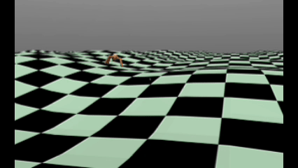

# Ant Robot Control Demos

This repository explores two methods for controlling a MuJoCo "Ant" robot:
1.  **Parameter Optimization:** Using simple algorithms (Random Search, Hill Climbing) to find optimal parameters.
2.  **Reinforcement Learning (PPO):** Using Stable-Baselines3 to train a neural network policy through trial and error.



---

## Part 1: Parameter Optimization

This method uses optimization algorithms (Random Search, Hill climber) to find the best set of parameters to make the ant walk.

* **Script:** `params_optim/params_optim.py`
* **World:** `assets/ant_pos_ctrl.xml` (Uses position-based actuators)
* **Best Parameters:** Saved in `params_optim/params/`

---

## Part 2: Reinforcement Learning (PPO)

This method uses PPO to train policies for different tasks. All models are pre-trained and saved in the `PPO_model/` directory.

### Basic Ant (Flat Terrain)
* **Goal:** Learns to walk forward on a flat plane.
* **World:** `assets/ant.xml`
* **Scripts:** `train.py`, `evaluate.py`
* **Model:** `PPO_model/ppo_myant_model.zip`

### Circle-Walking Ant (Flat Terrain)
* **Goal:** Uses a `CircleRewardWrapper` to reward turning (yaw velocity), encouraging circular motion.
* **World:** `assets/ant.xml`
* **Script:** `wrapper_train.py` (contains the custom wrapper) , `evaluate.py` (need to modified the path)
* **Model:** `PPO_model/ppo_myant_circle_model.zip`

### Uneven Terrain Ant
* **Goal:** Trains the ant to walk on uneven terrain using a custom `uneven_Wrapper` for height randomization and orientation checks.
* **World:** `assets/ant_uneven.xml` (uses `assets/terrain_1.png`)
* **Scripts:** `uneven_train.py`, `evaluate_uneven.py`
* **Model:** `PPO_model/ppo_myant_uneven_model.zip`

---
## How to Run


### Part 1: Parameter Optimization

This method uses the `params_optim/params_optim.py` script, which takes commands to either `visualize` (evaluate) or `train` a set of CPG parameters.

#### Evaluate (Visualize Parameters)

This loads the `.json` parameter files from `params_optim/params/` and runs them in the simulator.

* **Visualize Random Search Policy:**
    ```bash
    python params_optim/params_optim.py visualize random
    ```

* **Visualize Hill Climber Policy:**
    ```bash
    python params_optim/params_optim.py visualize hill
    ```

* **Visualize Best Policy (Combined):**
    This is the default and shows the best result from the combined RS+HC training.
    ```bash
    python params_optim/params_optim.py visualize combined
    ```

#### Train (from Scratch)

* **Train All Methods & Compare (Default):**
    Runs Random Search, Hill Climber, and a combined (RS+HC) approach, each for 20,000 iterations. It saves all resulting parameters and a final `comparison_learning_curve.png` plot.
    ```bash
    python params_optim/params_optim.py train
    ```

* **Train Only One Method:**
    You can also choose to run only one specific algorithm. This will run the chosen method for 20,000 iterations and save its corresponding parameter file.

    ```bash
    # Run only Random Search
    python params_optim/params_optim.py train random

    # Run only Hill Climber
    python params_optim/params_optim.py train hill

    # Run only the Combined (10k RS + 10k HC) method
    python params_optim/params_optim.py train combined
    ```


### Part 2: Reinforcement Learning (PPO)

These scripts use `stable_baselines3` to load or train neural network policies.

#### Evaluate (Pre-trained Models)

* **Basic Ant (Flat Terrain)**
    Runs the pre-trained model for walking on a flat plane.
    ```bash
    python evaluate.py
    ```

* **Uneven Terrain Ant**
    Runs the pre-trained model on the uneven terrain world.
    ```bash
    python evaluate_uneven.py
    ```

* **Circle-Walking Ant**
    This model uses the basic `evaluate.py` script with one modification:
    1.  Open `evaluate.py`.
    2.  Find the line: `model = PPO.load("PPO_model/ppo_myant_model.zip")`.
    3.  Change it to load the circle model: `model = PPO.load("PPO_model/ppo_myant_circle_model.zip")`.
    4.  Save the file and run it:
        ```bash
        python evaluate.py
        ```

#### Train (from Scratch)

**Note:** Running these scripts will overwrite the pre-trained models in the `PPO_model/` directory.

* **Basic Ant (Flat Terrain)**
    Trains the basic ant and saves the result as `ppo_myant_model.zip`.
    ```bash
    python train.py
    ```

* **Circle-Walking Ant (Flat Terrain)**
    Trains the ant using the `CircleRewardWrapper` and saves as `ppo_myant_circle_model.zip`.
    ```bash
    python wrapper_train.py
    ```

* **Uneven Terrain Ant**
    Trains the ant using the `uneven_Wrapper` on the rugged terrain and saves as `ppo_myant_uneven_model.zip`.
    ```bash
    python uneven_train.py
    ```