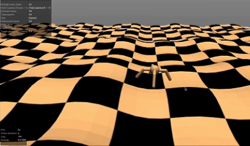

# Robotics Studio RL PPO Demo

This repository demonstrates how to train a simulated "Ant" robot using Proximal Policy Optimization (PPO), a reinforcement learning algorithm. It includes three different training scenarios: a basic implementation, one that encourages the ant to walk in a straight line, and an advanced version where the ant learns to walk on uneven terrain.


## Scenarios

### 1. Basic Ant (`main_basic.py`)

This is a standard implementation of the Ant environment from the Gymnasium library. The goal is to get the ant to walk forward as far as possible without falling over.

### 2. Straight-Walking Ant (`main_straight.py`)

This scenario modifies the reward function to encourage the ant to walk in a straight line. It does this by:
* **Rewarding forward velocity**: The ant gets a higher reward for moving forward (positive x-velocity).
* **Penalizing sideways velocity**: The ant is penalized for any sideways movement (y-velocity).

This results in a more stable and efficient gait compared to the basic implementation.

### 3. Advanced Ant on Uneven Terrain (`main_advanced.py`)

This is the most complex scenario. The ant is trained on a custom-generated uneven terrain. The key features of this implementation are:
* **Custom Environment**: A Python script (`env_func.py`) generates a heightfield image (`terrain.png`) and a MuJoCo XML file (`ant_uneven.xml`) to create the uneven terrain.
* **Custom Wrapper**: A `CustomAntWrapper` class is used to modify the environment's behavior. This includes:
    * A reward function that encourages forward movement and penalizes sideways movement, similar to the straight-walking ant.
    * Custom termination conditions based on the ant's height and orientation to ensure it stays upright and on the terrain.
    * The ability to set a custom initial starting position for the ant.

## How to Run

To run any of the scenarios, execute the corresponding Python script from your terminal:

```bash
# For the basic Ant
python main_basic.py

# For the straight-walking Ant
python main_straight.py

# For the advanced Ant on uneven terrain
python main_advanced.py